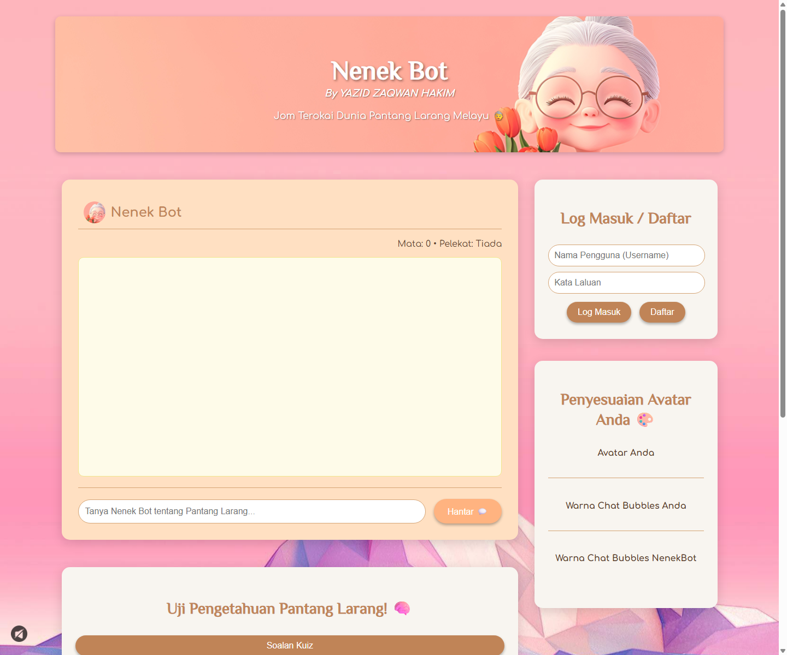

<p align="center">
  
</p>

<h1 align="center">NenekBot</h1>

<p align="center">
  A friendly Flask chatbot and learning platform for exploring <strong>Pantang Larang Melayu</strong> through AI chat, quizzes, gamification, and community interaction.
</p>

<p align="center">
  <a href="https://github.com/Xid03/NenekBot">
    
  </a>
  <a href="https://github.com/Xid03/NenekBot/commits/main">
    
  </a>
  
  
  
</p>

---

## Project Overview

**NenekBot** is an interactive web application that helps users learn about Malay cultural taboos, beliefs, and traditional advice in a fun and approachable way. The project combines an AI-powered chatbot with quiz-based learning, user accounts, points, stickers, avatar customization, leaderboards, and a community chat experience.

The app is designed for students, culture learners, educators, and anyone interested in exploring **Pantang Larang Melayu** with a modern web interface.

---

## Features

| Feature | Description |
| --- | --- |
| AI Chatbot | Ask questions about Pantang Larang Melayu and receive conversational responses powered by Groq's OpenAI-compatible API. |
| Interactive Quiz | Generate quiz questions, answer multiple-choice challenges, and learn through explanations. |
| Gamification | Earn points, collect stickers, and track progress as you interact with the app. |
| User Authentication | Register, log in, log out, and maintain user-specific progress using Flask-Login. |
| Leaderboard | Compare scores with other users through a points-based ranking system. |
| Avatar Customization | Unlock and apply profile avatars and chat bubble themes using earned points. |
| Community Chat | Chat with other users in a shared community space with auto-refreshing messages. |
| SQLite Persistence | Store users, progress, customization settings, and chat history locally. |
| Responsive UI | Single-page interface built with HTML, CSS, JavaScript, and Flask templates. |

---

## Tech Stack

| Layer | Technology |
| --- | --- |
| Backend | Python, Flask |
| Database | SQLite, Flask-SQLAlchemy |
| Authentication | Flask-Login, Werkzeug password hashing |
| AI Provider | Groq API using the OpenAI Python SDK |
| Frontend | HTML5, CSS3, JavaScript |
| Templates | Jinja2 |
| Environment Config | python-dotenv |

---

## Installation

### Prerequisites

Make sure you have these installed:

- Python 3.10 or newer
- Git
- A Groq API key

### Clone the Repository

```bash
git clone https://github.com/Xid03/NenekBot.git
cd NenekBot
```

### Create a Virtual Environment

Windows:

```bat
py -m venv .venv
.venv\Scripts\activate
```

macOS/Linux:

```bash
python3 -m venv .venv
source .venv/bin/activate
```

### Install Dependencies

```bash
pip install -r requirements.txt
```

### Configure Environment Variables

Create a local environment file from the example:

Windows:

```bat
copy app.env.example app.env
```

macOS/Linux:

```bash
cp app.env.example app.env
```

Then update `app.env` with your values:

```env
GROQ_API_KEY=your_groq_api_key_here
SECRET_KEY=change_this_secret_key
```

> Keep `app.env` private. It is ignored by Git because it contains secrets.

---

## Usage

Start the Flask development server:

```bash
python PantangLarangGuide.py
```

On Windows, you can also use:

```bat
py PantangLarangGuide.py
```

Open the app in your browser:

```text
http://127.0.0.1:5000
```

Typical workflow:

1. Register or log in.
2. Ask NenekBot questions about Pantang Larang Melayu.
3. Generate quiz questions and answer them.
4. Earn points and stickers.
5. Customize your avatar and chat bubbles.
6. Check the leaderboard and join the community chat.

---

## Screenshots

### Home Interface



---

## Demo

Live deployment is not configured yet. You can run the project locally with:

```bash
python PantangLarangGuide.py
```

Local demo URL:

```text
http://127.0.0.1:5000
```

---

## Free Deployment

This project is ready for free Flask deployment on platforms such as **Render** or **Koyeb**.

### Recommended Option: Render

1. Push the latest code to GitHub.
2. Go to [Render](https://render.com/) and create a **New Web Service**.
3. Connect this repository:

   ```text
   https://github.com/Xid03/NenekBot
   ```

4. Use these settings:

   | Setting | Value |
   | --- | --- |
   | Runtime | Python 3 |
   | Build Command | `pip install -r requirements.txt` |
   | Start Command | `gunicorn --bind 0.0.0.0:$PORT PantangLarangGuide:app` |

5. Add environment variables in the Render dashboard:

   ```env
   GROQ_API_KEY=your_groq_api_key_here
   SECRET_KEY=your_secure_secret_key
   ```

6. Deploy the service and open the generated `.onrender.com` URL.

> Note: Free web services may sleep after inactivity, so the first request after a pause can take longer to load.

### Alternative Option: Koyeb

Koyeb can also deploy this app from GitHub. The included `Procfile` tells Koyeb to run:

```text
web: gunicorn --bind 0.0.0.0:$PORT PantangLarangGuide:app
```

Add `GROQ_API_KEY` and `SECRET_KEY` as environment variables in the Koyeb service settings before deploying.

---

## Folder Structure

```text
NenekBot/
+-- docs/
|   +-- screenshots/
|       +-- home.png
+-- instance/
|   +-- nenekbotdb.db          # Local SQLite database, ignored by Git
+-- static/
|   +-- background.jpg
|   +-- background_music.mp3
|   +-- icon.png
|   +-- nenek.jpg
|   +-- ...
+-- templates/
|   +-- index_PantangBot.html
+-- .gitignore
+-- .python-version
+-- app.env.example
+-- PantangLarangGuide.py
+-- Procfile
+-- README.md
+-- requirements.txt
```

---

## Future Improvements

- Add a production deployment configuration.
- Add automated tests for authentication, quiz scoring, and chat routes.
- Add an admin panel for reviewing community Pantang Larang submissions.
- Improve database migration handling with Flask-Migrate.
- Add Docker support for easier setup.
- Add CI checks with GitHub Actions.
- Add more screenshots and a hosted demo link.
- Improve mobile layout polish and accessibility states.

---

## Contact Information

Created by **Xid03**.

- GitHub: [@Xid03](https://github.com/Xid03)
- Repository: [NenekBot](https://github.com/Xid03/NenekBot)

For suggestions, bugs, or collaboration ideas, open an issue in the repository.
